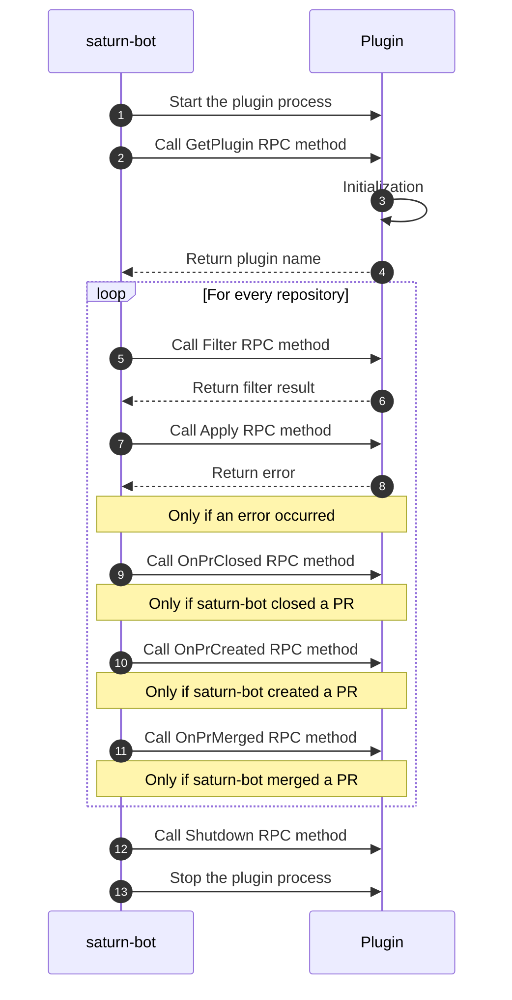

# Plugin

This document details the implementation of plugins.

## How it works

A plugin is a long-running process.
saturn-bot starts the process after it has parsed the task file that references the plugin.
If two tasks reference the same plugin, saturn-bot starts two independent processes.

[hashicorp/go-plugin](https://github.com/hashicorp/go-plugin)
defines and implements the protocol that saturn-bot uses to communicate with a plugin.



## Logging

Messages written to stdout and stderr streams by the plugin gets send to saturn-bot.
saturn-bot then logs these messages.
It uses log level `debug` by default.

saturn-bot supports setting the level of a log written by a plugin.
A plugin needs to write a line in the format `<level>%|%<message>`.

Example:
```text
info%|%This is an example
```

This configuration is done by the SDKs.
A user does not need to do anything.

Logs are filtered by log level and won't appear if the [`logLevel`](https://saturn-bot.readthedocs.io/en/stable/reference/configuration/#loglevel) of saturn-bot is too high.

For example, if `logLevel=info` and a plugin logs `debug%|%Debug Log`, then saturn-bot won't log the message.
