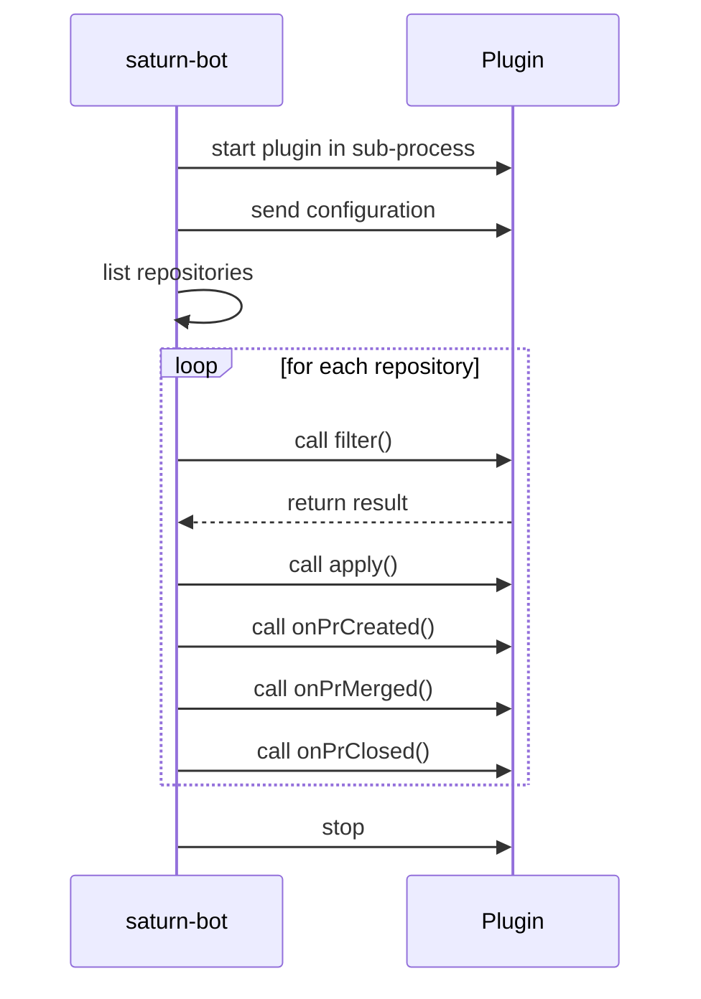

# Plugins

saturn-bot allows users to implement their own filter and processing logic. It is also possible to react to actions of saturn-bot, like creating, merging or closing a pull request.

Plugins can be written in [Go](go.md), [Kotlin](kotlin.md) and [Python](python.md).

## Lifecycle of a plugin

saturn-bot starts each plugin of a task in a new sub-process. It communicates with plugins over gRPC.



## Logs of a plugin

A plugin captures its `stdout` and `stderr` streams and sends any output to the main process of saturn-bot.
The main process then writes the output to its logs:

=== "Go"

    ```go
    // Other code omitted for brevity
    type LogExample struct{
        saturnbot.BasePlugin
    }

    func (p *LogExample) Apply(ctx saturnbot.Context) error {
        fmt.Println("Hello plugin")
        // ...
    }
    // ...
    ```

=== "Kotlin"

    ```kotlin
    // Other code omitted for brevity
    class LogExample : Plugin() {
        override fun apply(ctx: Context) {
            System.out.println("Hello plugin")
            // ...
        }
    }
    // ...
    ```

=== "Python"

    ```python
    # Other code omitted for brevity
    class LogExample(Plugin):
        def apply(self, ctx: Context) -> None:
            print("Hello plugin")
            # ...
    # ...
    ```

When saturn-bot calls the plugin as part of a task, it logs the following message:

```text
PLUGIN [log-example stdout] Hello plugin
```

The pattern of the log message is:

```text
PLUGIN [<name of plugin> <stderr|stdout> <message>]
```

!!! info

    By default, saturn-bot uses the `debug` level to write log messages.
    Either set the [global log level](../../configuration.md#loglevel) to `debug` to see log messages or change the [log level of plugins](../../configuration.md#pluginloglevel).

## Skip initialization during CI runs

[`saturn-bot ci`](../../commands/ci.md) starts and initializes plugins.
In case this behavior isn't desired, for example because a plugin contacts outside APIs,
the plugin can detect that it is part of a CI run:

=== "Go"

    ```go
    // Other code omitted for brevity
    type Example struct{
        saturnbot.BasePlugin
    }

    func (p *Example) Init(config map[string]string) error {
        if config["saturn-bot.ci"] == "true" {
            // Return early, don't execute init code.
            return nil
        }

        // Initialization code
    }
    // ...
    ```

=== "Kotlin"

    ```kotlin
    // Other code omitted for brevity
    class Example : Plugin("example") {
        override fun init(config: Map<String, String>) {
            if (config["saturn-bot.ci"] == "true") {
                // Return early, don't execute init code.
                return
            }

            // Initialization code
        }
    }
    // ...
    ```

=== "Python"

    ```python
    # Other code omitted for brevity
    class Example(Plugin):
        name = "example"

        def init(self, config: Mapping[str, str]) -> None:
            if config.get("saturn-bot.ci", "false") == "true":
                # Return early, don't execute init code.
                return None
            # Initialization code
    # ...
    ```

## Debug a plugin

If [logs](#logs-of-a-plugin) aren't enough to understand what a plugin is doing, it is possible to start the plugin process separately and attach a debugger:

1. [Install](../../../installation.md) saturn-bot
1. Start the plugin in a debug process. How to do this depends on the IDE.

    - [Debugging in Visual Studio Code](https://code.visualstudio.com/docs/editor/debugging)
    - [Debug code](https://www.jetbrains.com/help/idea/debugging-code.html) in the IntelliJ IDEA documentation.

    The plugin prints a connection string to the standard output.

    Example:

    ```text
    1|1|tcp|127.0.0.1:11049|grpc
    ```

    Copy the connection string.

1. In a new terminal window, make saturn-bot connect to the plugin and call the function to debug:
    ```shell
    saturn-bot plugin apply --address '1|1|tcp|127.0.0.1:11049|grpc'
    ```

[plugin](../../commands/plugin.md) describes all available options of the command `saturn-bot plugin`.
