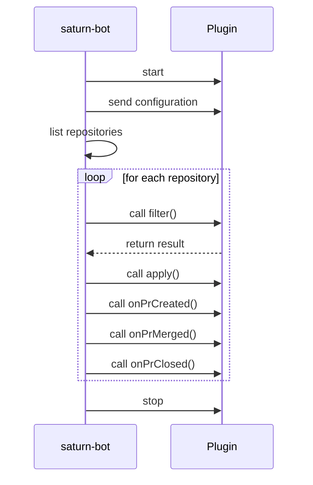

# Plugins

saturn-bot allows users to implement their own filter and processing logic. It is also possible to react to actions of saturn-bot, like creating, merging or closing a pull request.

Plugins can be written in [Go](go.md), [Kotlin](kotlin.md) and [Python](python.md).

## Lifecycle of a plugin

saturn-bot starts each plugin of a task in a new sub-process. It communicates with plugins over gRPC.



## Debug a plugin

1. [Install](../../installation.md) saturn-bot
1. Start the plugin in a debug process. How to do this depends on the IDE.

    - [Debugging in Visual Studio Code](https://code.visualstudio.com/docs/editor/debugging)
    - [Debug code](https://www.jetbrains.com/help/idea/debugging-code.html) in the IntelliJ IDEA documentation. The plugin prints a connection string to the standard output.

    Example:

    ```text
    1|1|tcp|127.0.0.1:11049|grpc
    ```

    Copy the connection string.

1. In a new terminal window, make saturn-bot connect to the plugin and call the function to debug:
    ```shell
    saturn-bot plugin apply --address '1|1|tcp|127.0.0.1:11049|grpc'
    ```
