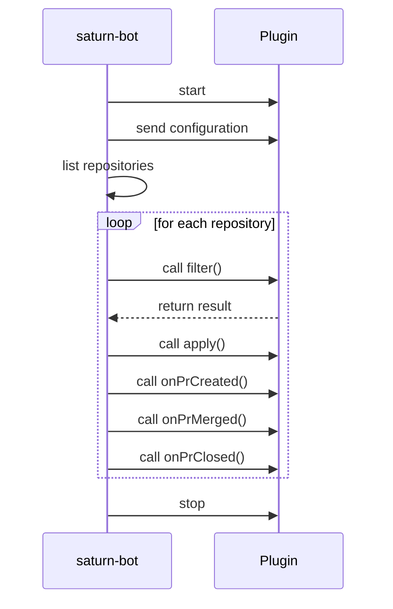

# Plugins

saturn-bot allows users to implement their own filter and processing logic. It is also possible to react to actions of saturn-bot, like creating, merging or closing a pull request.

Plugins can be written in [Go](go.md), [Kotlin](kotlin.md) and [Python](python.md).

## Lifecycle of a plugin

saturn-bot starts each plugin of a task in a new sub-process. It communicates with plugins over gRPC.

